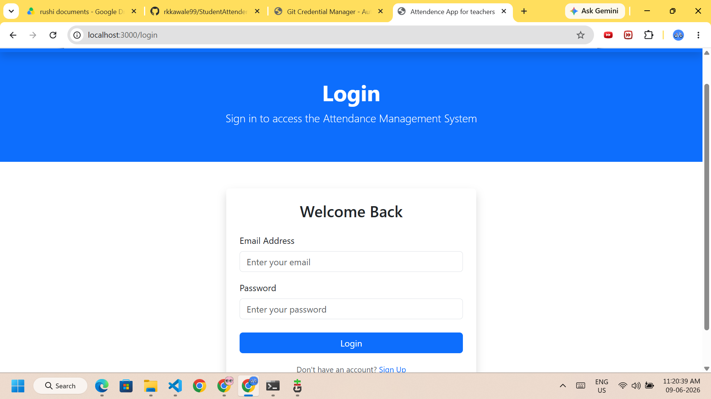
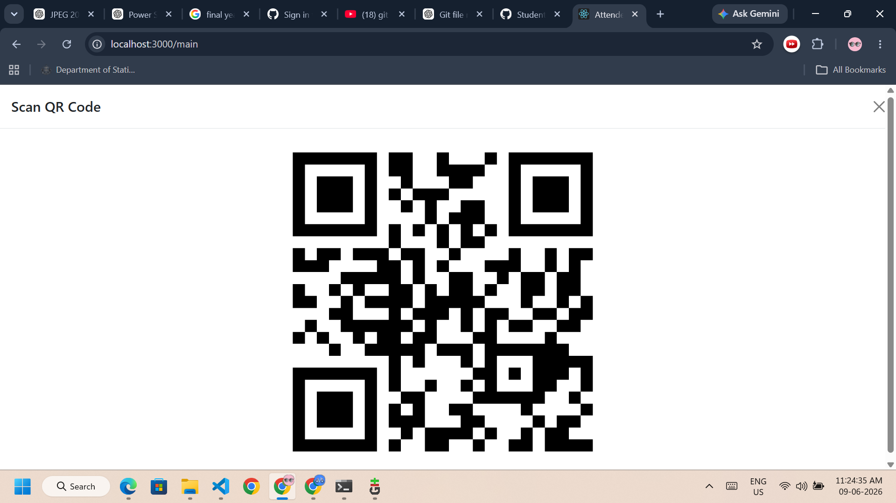
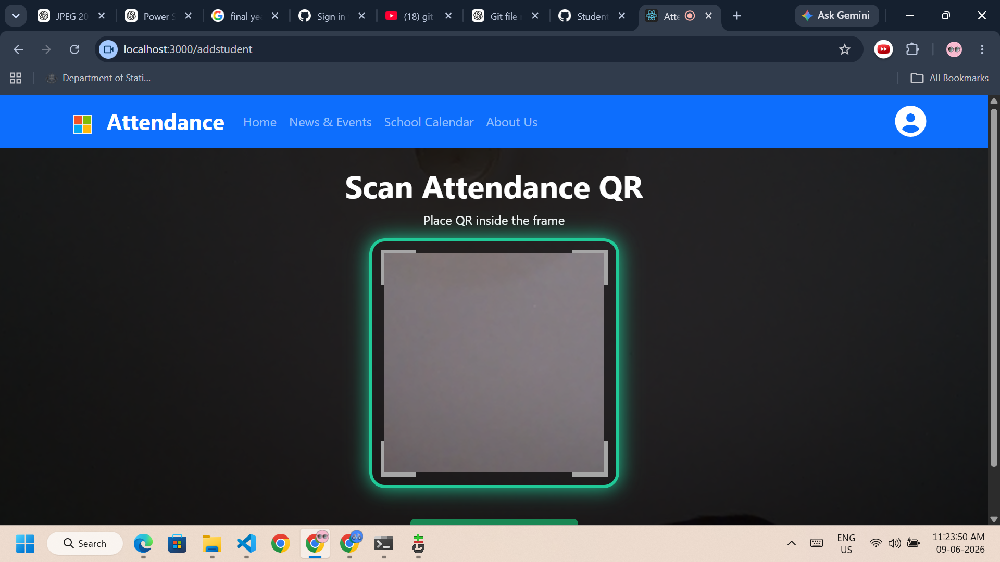

# Student Attendance Management System

A QR Code Based Student Attendance Management System built using React.js, Node.js, Express.js, and MongoDB.

## Features

* Student Registration and Management
* QR Code Generation for Students
* QR Code Scanning for Attendance
* Batch/Class Management
* Real-time Attendance Tracking
* Attendance History and Reports
* Responsive User Interface
* RESTful API Integration

## Tech Stack

### Frontend

* React.js
* React Router DOM
* HTML5 QR Code Scanner

### Backend

* Node.js
* Express.js
* MongoDB
* Mongoose
* JWT Authentication

## Project Structure

```text
StudentAttendenceSystem/
│
├── attendence-fronted/
│   ├── public/
│   ├── src/
│   └── package.json
│
├── Backend/
│   ├── models/
│   ├── routes/
│   ├── utils/
│   ├── db.js
│   ├── index.js
│   └── package.json
│
└── README.md
```

## Installation

### Clone Repository

```bash
git clone https://github.com/rkkawale99/StudentAttendenceSystem
cd StudentAttendenceSystem
```

### Backend Setup

```bash
cd Backend
npm install
npm start
```

### Frontend Setup

```bash
cd attendence-fronted
npm install
npm start
```

## How It Works

1. Students are registered in the system.
2. A unique QR Code is generated for each student.
3. Faculty scans the student's QR Code.
4. Attendance is automatically recorded in MongoDB.
5. Attendance records can be viewed and managed through the dashboard.

## Future Enhancements

* Email Notifications
* Attendance Analytics Dashboard
* Export Attendance Reports (PDF/Excel)
* Face Recognition Integration
* Mobile Application Support

## Screenshots

Add screenshots of:

* Login Page
  
* Dashboard(Teacher)
  .png)
* QR Code Generation
 
* QR Code Scanner
*  
* Attendance Reports
   .png)

## Author

Rushi Kawale

## License

This project is developed for educational and learning purposes.
